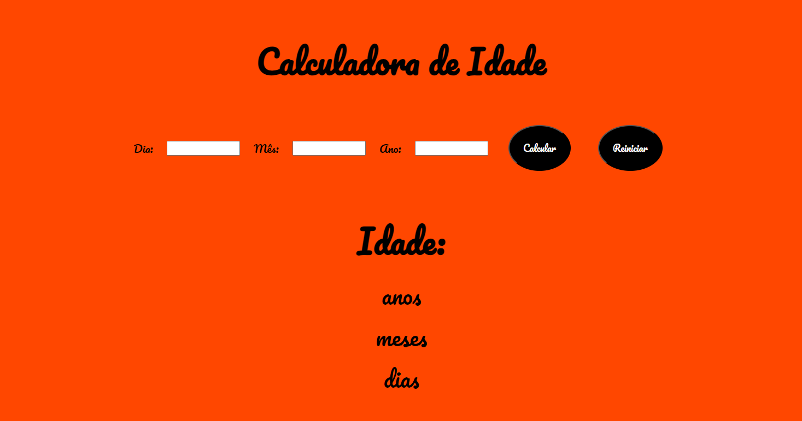

Calculadora de Idade

O Projeto consiste em mostrar a idade em dia mês e ano, após introduzir a data de nascimento.
Após digitar a data de nascimento, o usuário clica em calcular e o programa fornecerá a idade, se quiser fazer outro calculo, basta clicar em reset que o programa é zerado para nova introdução de dados.

As linguagens de programação utilizadas foram:

https://palomabonattedealmeida.github.io/calculadoraIdade/